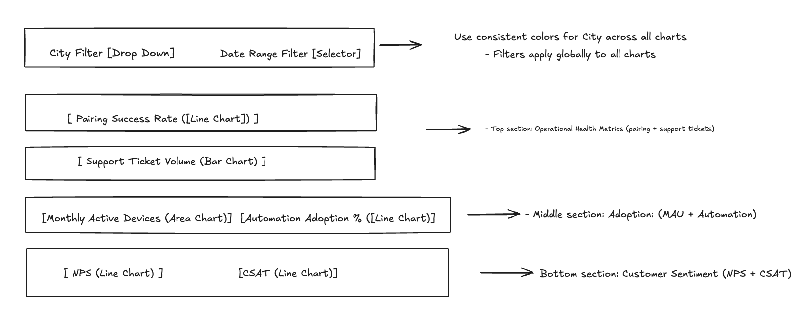

# Smart Home Product Analytics Dashboard – PRD

## 1. Project Purpose & Insights

A lightweight internal dashboard enabling PM, Ops, and Executives to monitor pairing success, automation adoption, customer sentiment, and support load for data-driven decisions.

### Key Insights:
- ✅ Identify device pairing failures.
- ✅ Detect operational bottlenecks via support load monitoring.
- ✅ Track city-level automation adoption.
- ✅ Correlate satisfaction (NPS, CSAT) with operations.
- ✅ Prioritize feature or support improvements.

---

## 2. Business Problem

- No visibility into onboarding performance.
- Automation adoption tracking missing.
- Scattered NPS/CSAT reporting.
- Need centralized, self-serve data access.

---

## 3. Goals & Success Metrics

| Goal                               | Metric                               |
| ---------------------------------- | ------------------------------------ |
| Track device adoption              | Weekly active devices chart          |
| Visualize automation usage         | Automation adoption rate trends      |
| Monitor customer sentiment         | NPS/CSAT visualization               |
| Enable decision-making             | Accessible live dashboard            |

---

## 4. User Personas

### 👤 Product Manager (PM)
- Needs data to prioritize features and support roadmap decisions.

### 👤 Operations Team Member (Ops)
- Needs pairing success and support trends to resolve operational issues.

### 👤 Senior Manager / Executive
- Needs high-level view of NPS, CSAT, and product health KPIs.

---

## 5. Key Features & Requirements

| Feature                   | Requirements                                           |
| ------------------------- | ------------------------------------------------------ |
| Active Devices Chart      | Daily/weekly count, category breakdown                 |
| Automation Adoption Chart | Adoption trends by city, % over time                   |
| NPS / CSAT Trends         | Monthly NPS + CSAT combined view                       |
| Support Tickets           | Ticket count over time, city segmentation              |
| Responsive Design         | Usable on desktop and mobile                           |

---

## 6. UI Wireframe



_This single dashboard wireframe visualizes:_
- KPI widgets for NPS, CSAT, and Active Devices.
- Charts for automation adoption, support tickets, and pairing success.
- City and time-range filters across all metrics.

---

## 7. Tech Stack

| Component           | Choice      | Rationale                      |
| ------------------- | ----------- | ------------------------------- |
| Front-end Framework | React (JSX) | Scalable modular UI            |
| Development         | VS Code     | Standard local development     |
| Version Control     | Git, GitHub | Collaboration and versioning   |
| Hosting             | Vercel      | Auto-deploy from GitHub        |

---

## 8. Sample JSON Schema

```json
[
  {
    "month": "Jan",
    "city": "Hanoi",
    "pairingRate": 92,
    "supportTickets": 125,
    "activeDevices": 3400,
    "automationAdoption": 57,
    "NPS": 42,
    "CSAT": 4.3
  }
]
```
This JSON schema serves as the backend data structure feeding the dashboard charts.

## 9. Solution Approach

This project was built using an AI-augmented development process:

- **Problem Framing:**  
  Defined business goals, success metrics, and solution scope in this PRD.

- **LLM-Assisted Development:**  
  Used ChatGPT to:
  - Scaffold React code and UI components.
  - Configure version control and CI/CD pipelines via GitHub and Vercel.
  - Draft product documentation and dashboard narrative.

- **Focus:**  
  Managed development from a product-first perspective, while utilizing LLM tools to execute technical steps without direct coding.

---

## 10. Live Demo & Repository

- **🔗 [View Dashboard on Vercel](https://vercel.com/nhatvyches-projects/smart-home-dashboard)**
- **🔗 [View GitHub Repository](https://github.com/nhatvyche/smart-home-dashboard)**

---

## 11. Business Impact

This dashboard consolidates product and operational insights into a single, accessible view—eliminating the need for manual reports and enabling faster, data-driven decisions.

**Benefits include:**
- Operational teams can proactively resolve pairing or support issues.
- PMs can prioritize features using real adoption and sentiment data.
- Executives gain a real-time, high-level summary of product health.
- Demonstrates the potential for AI-assisted product development, enabling non-technical professionals to deliver functional outcomes efficiently.
